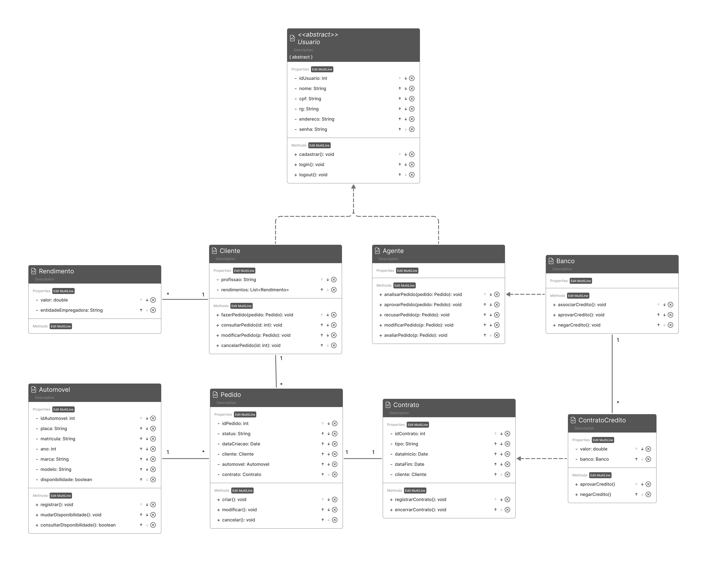
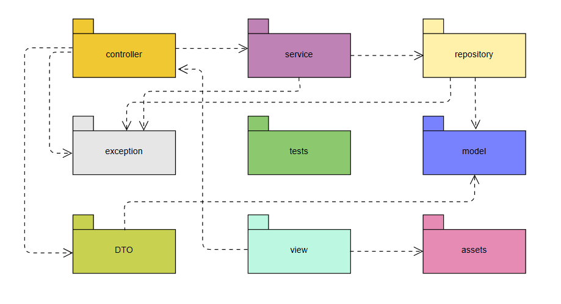

# Sistema de Aluguel de Carros

Projeto desenvolvido para a disciplina de **Projetos de Software**.  
O sistema tem como objetivo apoiar a **gestão de aluguéis de automóveis**, permitindo que clientes realizem cadastro, efetuem, modifiquem e cancelem pedidos de aluguel. Já os agentes (empresas e bancos) podem avaliar e aprovar os pedidos, vinculando-os a contratos de crédito quando necessário. O sistema também registra informações sobre clientes, automóveis e contratos de forma estruturada.

## 👥 Integrantes
- Arthur Candian De Azevedo Moia
- Luis Henrique Fantini Almeida
- Rafael de Oliveira Caldeira Lopes

## 📊 Diagramas do Projeto

### Diagrama de Casos de Uso
Representa as principais interações entre os **usuários (clientes e agentes)** e o sistema, destacando as funcionalidades de cadastro, pedidos, etc.

### Histórias do Usuário
Documento que descreve, como os **usuários interagem com o sistema** e quais objetivos buscam alcançar.

[📄 Histórias de Usuário](./docs/historias-de-usuario.pdf)

### Diagrama de Classes
Apresenta a **estrutura do sistema** em termos de classes, atributos e relacionamentos, servindo de base para a implementação.

### Diagrama de Pacotes (Visão Lógica)
Mostra a **organização lógica dos pacotes** no projeto, seguindo o padrão **MVC (Model-View-Controller)** adaptado ao contexto do sistema.

